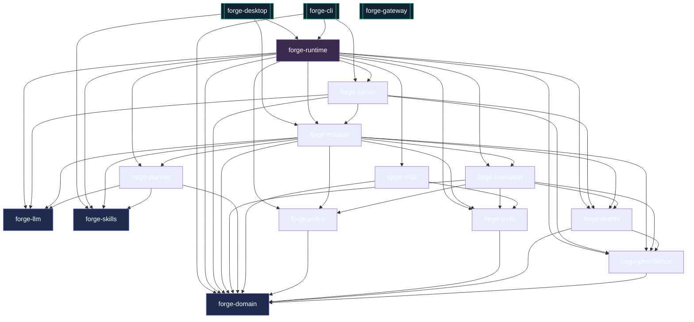
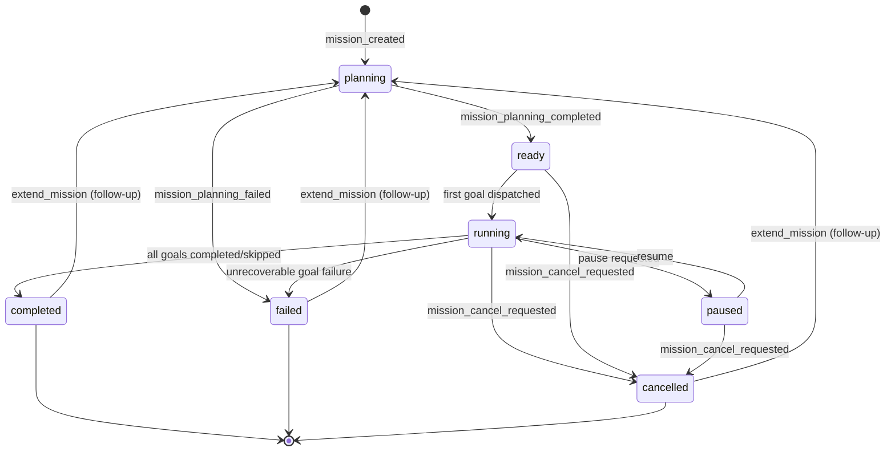
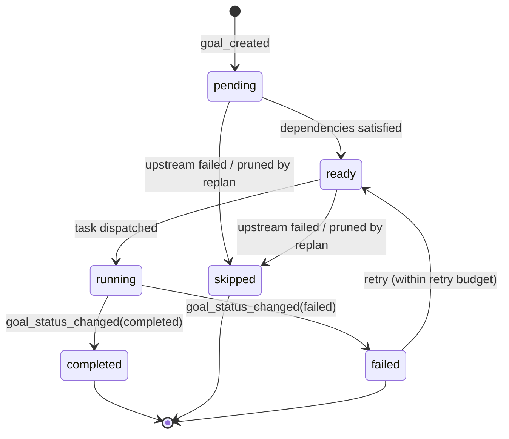
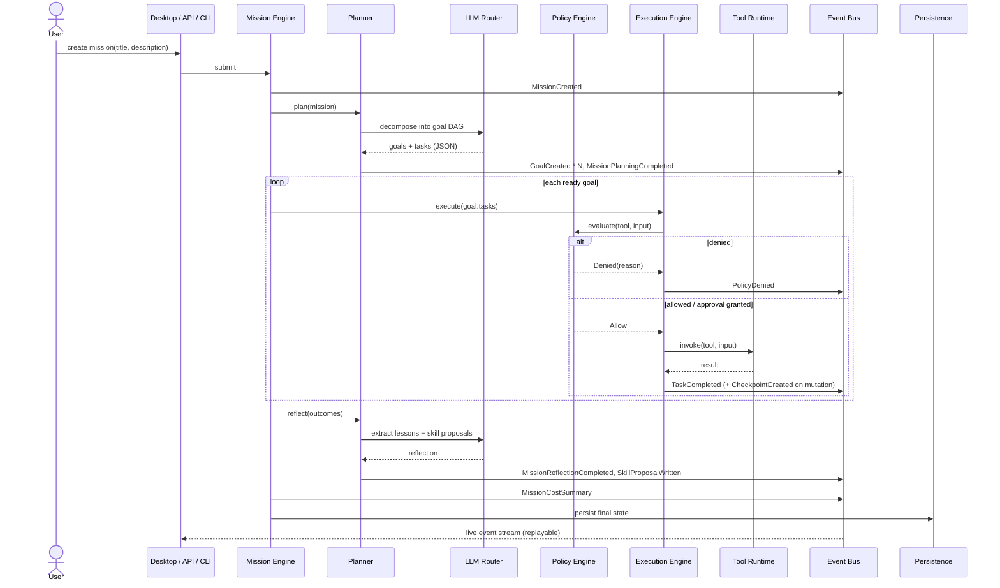
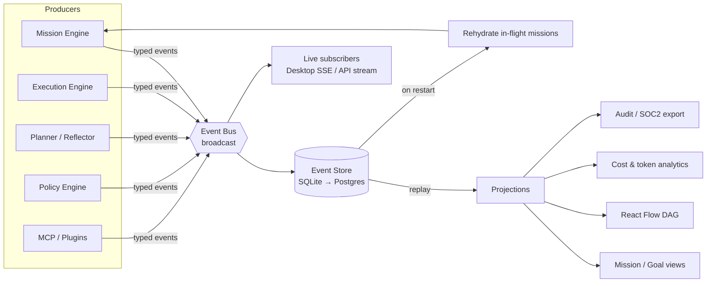
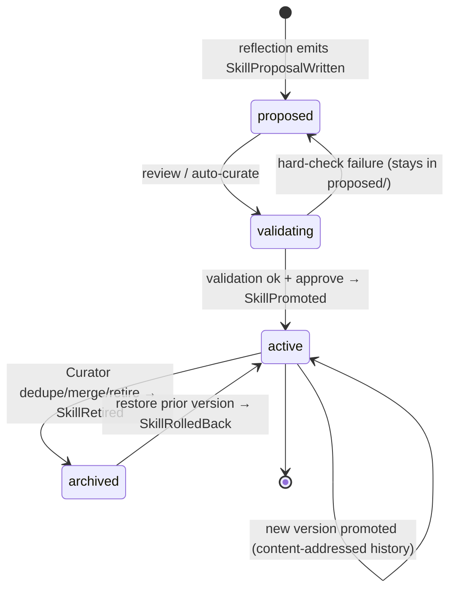
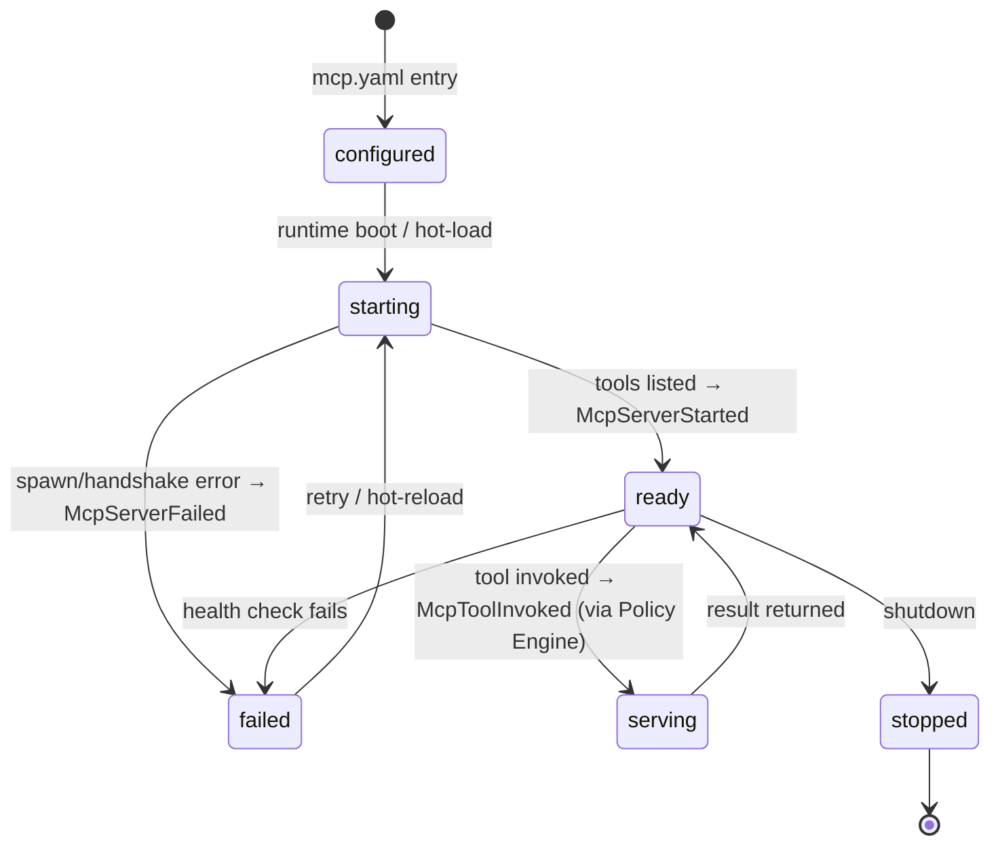

# Forge OS — Architecture Diagrams

Visual companion to `ARCHITECTURE.md`, closing agent.txt *Deliverables* items
21–27 (state machines, sequence diagrams, data-flow diagrams, dependency graph,
plugin/skill/mission lifecycles). Every diagram is grounded in the actual crate
graph and event/state enums shipped in this repo — not aspirational.

All diagrams use [Mermaid](https://mermaid.js.org/), which GitHub renders
natively in Markdown.

---

## 1. Crate dependency graph (Deliverable 24)

The workspace follows Hexagonal / Clean Architecture: `forge-domain` is the
dependency-free core; every arrow points **inward** toward it. `forge-runtime`
is the composition root that wires everything together; the three binaries
(`forge-cli`, `forge-gateway`, `forge-desktop`) sit at the outermost ring.

> Edges are the real `[dependencies]` from each `Cargo.toml`. `forge-server`'s
> reference to `forge-runtime` is a **dev-dependency** (its API smoke example)
> and is intentionally omitted so the library graph stays acyclic.

`forge-gateway` has no internal crate deps by design — it is a thin webhook
receiver (Slack/Discord/Telegram) that forwards to the API over HTTP, keeping
the messaging surface decoupled from the runtime.

---

## 2. Mission lifecycle (Deliverable 27, state machine)

`MissionStatus` transitions as the engine plans, executes, and finalises a
mission. Terminal states are `completed`, `failed`, and `cancelled`; a
completed/failed mission can be **extended** with a follow-up prompt, which
re-enters planning.

## 3. Goal lifecycle (Deliverable 26, state machine)

Each goal in the DAG advances independently. A goal becomes `ready` only once
all its `depends_on` predecessors are terminal. Replanning can inject new
`pending` goals mid-flight.

---

## 4. Plan → execute → reflect (Deliverable 22, sequence)

The end-to-end path of a single mission through the runtime. The LLM appears
only as a bounded reasoning component behind the planner — every other box is
deterministic runtime code (agent.txt *Core Philosophy*).

---

## 5. Event-sourcing data flow (Deliverable 23)

Every state change is an **append-only event**. The persisted event log is the
source of truth; read models (mission views, DAG, cost) are projections that can
be rebuilt by replaying the log. This is what makes the runtime resumable,
auditable, and replayable (agent.txt *Event Bus*, *Persistence*).

---

## 6. Skill lifecycle (Deliverable 26)

Skills are executable procedural knowledge that **evolve** through the learning
loop. Nothing is overwritten: promotion is content-addressed and every version
is retained, so any change is reversible (agent.txt *Self-Improvement*).

Hard validation checks (deterministic, no LLM): `parses`, `body_length ≥ 40`,
`has_trigger`, `tools_declared`, `tools_resolvable`. See
`crates/forge-skills/src/validate.rs`; the seed library is gated by
`crates/forge-skills/tests/seed_skills.rs`.

---

## 7. Plugin / MCP lifecycle (Deliverable 25)

Plugins are first-class runtime modules. The preferred surface is MCP: each
configured server is spawned, health-checked, and its tools are registered into
the Tool Runtime under an `mcp:<server>` namespace. Native plugins follow the
same lifecycle.

Every plugin tool call still passes through the Policy Engine before execution,
so sandboxing and least-privilege apply uniformly to native and MCP tools.

---

## Regenerating / validating

These diagrams are plain Mermaid in Markdown — no build step. Paste any block
into the [Mermaid Live Editor](https://mermaid.live) to validate syntax, or rely
on GitHub's native rendering. When the crate graph or an event/state enum
changes, update the corresponding block here and in `ARCHITECTURE.md`.
